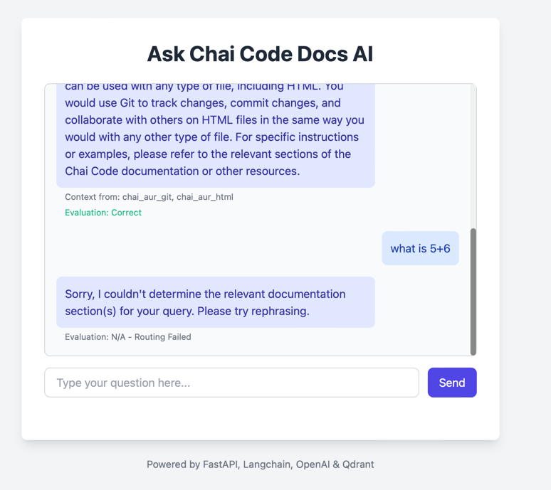

# RAG Application for Chai Code Docs

This project implements a Retrieval-Augmented Generation (RAG) application using FastAPI, Langchain, OpenAI, and Qdrant. It allows users to ask questions about the content hosted on `https://docs.chaicode.com/` via a simple web interface.

## Features

* **Dynamic Section Discovery:** Scrapes the main documentation page (`/youtube/getting-started/`) to dynamically find documentation sections based on the navigation structure (`ul.top-level`).
* **Subsection Scraping:** For each discovered section, scrapes the content of its specific subsection pages listed in the navigation.
* **Vector Storage:** Embeds scraped subsection content using OpenAI and stores it in Qdrant vector database. All subsections for a main topic (e.g., `chai-aur-html`) are stored in a single collection named after that main topic (e.g., `chai_aur_html`).
* **Multi-Namespace Routing:** Uses an OpenAI LLM to determine one or more relevant documentation sections (Qdrant collections) based on the user's query.
* **Multi-Retrieval:** Performs similarity search within the determined Qdrant collections (up to 2 by default) to find relevant context.
* **Generation:** Uses an OpenAI LLM to generate an answer based on the user's query and the combined retrieved context from potentially multiple collections.
* **Evaluation:** Uses an OpenAI LLM to evaluate the faithfulness and relevance of the generated answer based on the retrieved context.
* **Web Interface:** Provides a simple chat interface built with FastAPI and HTML/JavaScript that displays the generated answer, the source namespace(s), and the evaluation result.




## Project Structure


rag_chaicode/
├── backend/
│ ├── main.py # FastAPI application logic
│ ├── templates/
│ │ └── index.html # Simple HTML frontend
│ ├── core/
│ │ ├── config.py # Configuration (API keys, Qdrant URL)
│ │ ├── llm.py # LLM interaction functions (OpenAI)
│ │ ├── retriever.py # Qdrant interaction functions
│ │ └── models.py # Pydantic models for API
│ └── init.py
├── scripts/
│ ├── ingest.py # Script for discovery, scraping, ingestion
│ └── init.py
├── .env # Environment variables (API keys, etc.)
├── requirements.txt # Project dependencies
└── README.md # This file
## Setup

1.  **Clone the repository:**
    ```bash
    git clone <your-repo-url>
    cd rag_chaicode
    ```

2.  **Create a virtual environment:**
    ```bash
    python -m venv venv
    source venv/bin/activate  # On Windows use `venv\Scripts\activate`
    ```

3.  **Install dependencies:**
    ```bash
    pip install -r requirements.txt
    # Ensure lxml is installed if not included by others
    pip install lxml
    ```

4.  **Set up Qdrant:**
    * The easiest way is to use Docker:
        ```bash
        docker run -p 6333:6333 -p 6334:6334 \
            -v $(pwd)/qdrant_storage:/qdrant/storage:z \
            qdrant/qdrant
        ```
    * Alternatively, you can use [Qdrant Cloud](https://cloud.qdrant.io/).
    * Ensure Qdrant is accessible at the URL specified in your `.env` file (default: `http://localhost:6333`).

5.  **Configure Environment Variables:**
    * Copy the `.env.example` file (or the `.env` content provided) to a new file named `.env`.
    * Fill in your `OPENAI_API_KEY`.
    * Adjust `QDRANT_URL` and `QDRANT_API_KEY` if necessary (API key is usually needed for Qdrant Cloud).

## Usage

1.  **Run the Ingestion Script:**
    * This script discovers sections, scrapes their specific subsections, creates embeddings, and stores them in Qdrant collections.
    * Make sure your Qdrant instance is running and your `.env` file is configured.
    * ```bash
        python scripts/ingest.py
        ```
    * This might take some time depending on the number of pages and rate limits. Monitor the logs.

2.  **Run the FastAPI Application:**
    * Navigate to the `backend` directory:
        ```bash
        cd backend
        ```
    * Start the server:
        ```bash
        uvicorn main:app --reload --host 0.0.0.0 --port 8000
        ```

3.  **Access the Chat Interface:**
    * Open your web browser and go to `http://localhost:8000`.
    * Enter your questions related to the Chai Code documentation in the chat input.

## How it Works

1.  **User Query:** The user enters a question in the web interface.
2.  **Namespace Selection:** The FastAPI backend sends the query to an OpenAI LLM with a specific prompt asking it to identify the most relevant documentation sections (namespaces/collections) from a dynamically fetched list of existing collections in Qdrant. It requests a comma-separated list.
3.  **Similarity Search:** The backend uses the identified namespaces (up to 2) to query the corresponding Qdrant collections, retrieving the most similar text chunks based on the query's embedding from each relevant collection.
4.  **Answer Generation:** The original query and the combined retrieved text chunks are sent to another OpenAI LLM prompt designed for RAG. The LLM generates a final answer based on the provided context.
5.  **Evaluation:** The query, retrieved context, and generated answer are sent to the LLM with an evaluation prompt to assess faithfulness and relevance.
6.  **Response:** The generated answer, the list of namespaces used for context, and the evaluation result are displayed back to the user in the chat interface.


