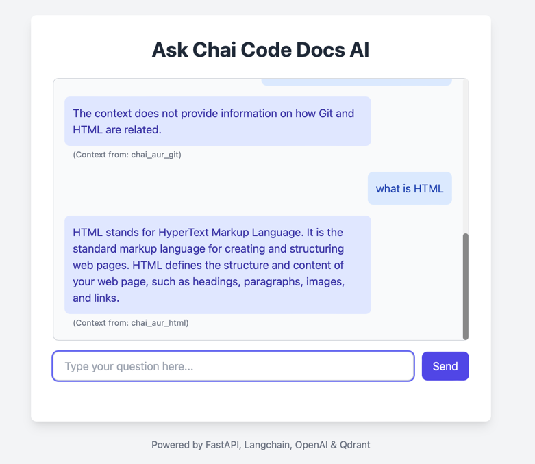

# RAG Application for Chai Code Docs

This project implements a Retrieval-Augmented Generation (RAG) application using FastAPI, Langchain, OpenAI, and Qdrant. It allows users to ask questions about the content hosted on `https://docs.chaicode.com/` via a simple web interface.

## Features

* **Web Scraping:** Scrapes specific sections of the Chai Code documentation.
* **Vector Storage:** Embeds scraped content using OpenAI and stores it in Qdrant vector database, using separate collections for different documentation sections (e.g., 'chai-aur-html', 'chai-aur-git').
* **Namespace Routing:** Uses an OpenAI LLM to determine the most relevant documentation section (Qdrant collection) based on the user's query.
* **Retrieval:** Performs similarity search within the determined Qdrant collection to find relevant context.
* **Generation:** Uses an OpenAI LLM to generate an answer based on the user's query and the retrieved context.
* **Web Interface:** Provides a simple chat interface built with FastAPI and HTML/JavaScript.

## Project Structure



rag_chaicode/
├── backend/
│ ├── main.py # FastAPI application logic
│ ├── templates/
│ │ └── index.html # Simple HTML frontend
│ ├── core/
│ │ ├── config.py # Configuration (API keys, Qdrant URL)
│ │ ├── llm.py # LLM interaction functions (OpenAI)
│ │ ├── retriever.py # Qdrant interaction functions
│ │ └── models.py # Pydantic models for API
│ └── init.py
├── scripts/
│ ├── ingest.py # Script for scraping and ingestion
│ └── init.py
├── .env # Environment variables (API keys, etc.)
├── requirements.txt # Project dependencies
└── README.md # This file
## Setup

1.  **Clone the repository:**
    ```bash
    git clone <your-repo-url>
    cd rag_chaicode
    ```

2.  **Create a virtual environment:**
    ```bash
    python -m venv venv
    source venv/bin/activate  # On Windows use `venv\Scripts\activate`
    ```

3.  **Install dependencies:**
    ```bash
    pip install -r requirements.txt
    ```

4.  **Set up Qdrant:**
    * The easiest way is to use Docker:
        ```bash
        docker run -p 6333:6333 -p 6334:6334 \
            -v $(pwd)/qdrant_storage:/qdrant/storage:z \
            qdrant/qdrant
        ```
    * Alternatively, you can use [Qdrant Cloud](https://cloud.qdrant.io/).
    * Ensure Qdrant is accessible at the URL specified in your `.env` file (default: `http://localhost:6333`).

5.  **Configure Environment Variables:**
    * Copy the `.env.example` file (or the `.env` content provided) to a new file named `.env`.
    * Fill in your `OPENAI_API_KEY`.
    * Adjust `QDRANT_URL` and `QDRANT_API_KEY` if necessary (API key is usually needed for Qdrant Cloud).

## Usage

1.  **Run the Ingestion Script:**
    * This script scrapes the specified Chai Code documentation pages, creates embeddings, and stores them in Qdrant collections.
    * Make sure your Qdrant instance is running and your `.env` file is configured.
    * ```bash
        python scripts/ingest.py
        ```
    * This might take some time depending on the number of pages and rate limits.

2.  **Run the FastAPI Application:**
    * Navigate to the `backend` directory:
        ```bash
        cd backend
        ```
    * Start the server:
        ```bash
        uvicorn main:app --reload --host 0.0.0.0 --port 8000
        ```

3.  **Access the Chat Interface:**
    * Open your web browser and go to `http://localhost:8000`.
    * Enter your questions related to the Chai Code documentation in the chat input.

## How it Works

1.  **User Query:** The user enters a question in the web interface.
2.  **Namespace Selection:** The FastAPI backend sends the query to an OpenAI LLM with a specific prompt asking it to identify the most relevant documentation section (namespace/collection) from a predefined list.
3.  **Similarity Search:** The backend uses the identified namespace to query the corresponding Qdrant collection, retrieving the most similar text chunks based on the query's embedding.
4.  **Answer Generation:** The original query and the retrieved text chunks are sent to another OpenAI LLM prompt designed for RAG. The LLM generates a final answer based on the provided context.
5.  **Response:** The generated answer is displayed back to the user in the chat interface.


